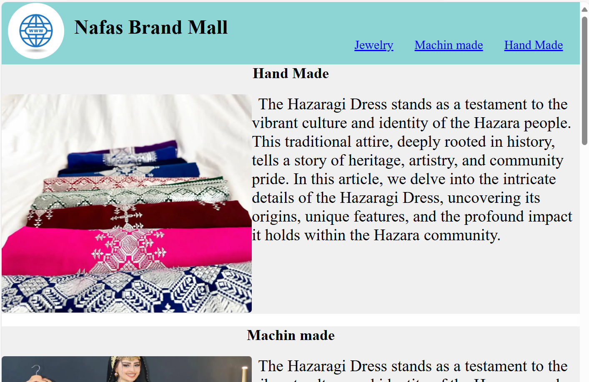
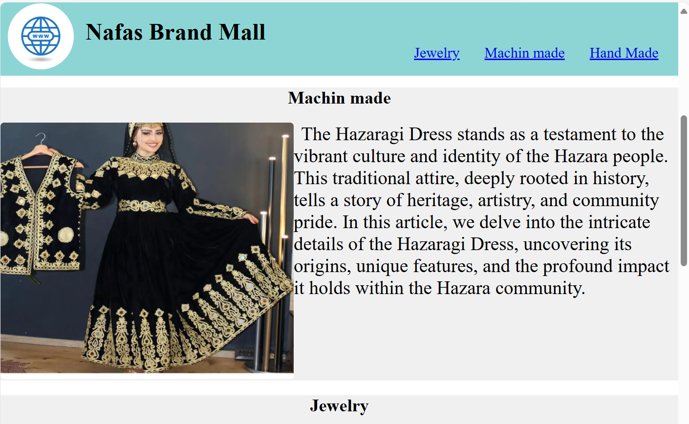
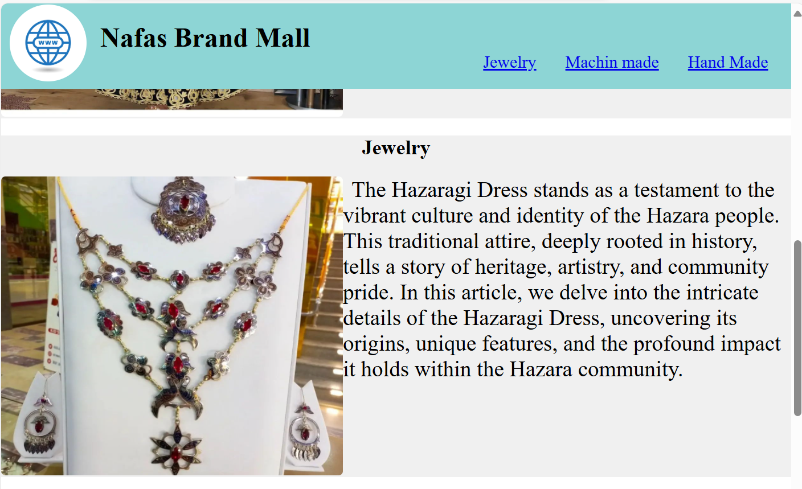
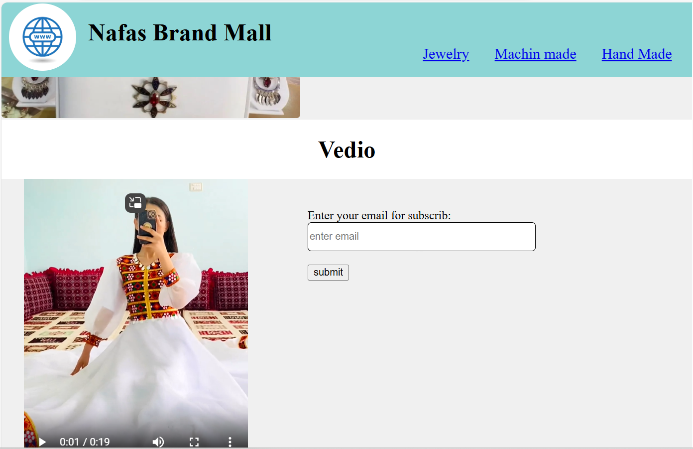

# landing-repo
## Project Description 📝

> This is Build a Product Landing Page for getting information about one business page.

## Demo 📸

## Technologies Used 🛠️

- HTML
- CSS

## Installation 💻

Folow these steps to set up the project on your local machine 
Ensure you have the following software installed on your machine

bash
#git clone

bash
#git@github.com:fatiabdulahi/Fati-sarvey.git

## Usage 🎯

you can access to my project through git clone 
-git clone the HTTP or My SSH code link from the repository you wat to clone 

 
#git clone

## Features ⭐

1: General Information
Name:
Email:
Age:
Gender:
2: Kitchen Use and Preferences
3: Food Taste Preferences
4: Suggestions and Feedback
## Author 👩‍💻

Fatima Abdullahi

- Email: [ fatima333abdullahi@gmail.com)

## Contributing 🤝

We welcome contributions from the community! Please follow the guidelines below to contribute to our project.
 
1: Fork the Repository: Click the "Fork" button at the top right of the repository page to create a copy of the repository on your GitHub account.
 
2: Clone Your Fork: Clone your forked repository to your local machine using the following command:git clone https://github.com/yourusername/yourprojectname.git
 
3: Create a Branch: Create a new branch for your work to ensure your changes are isolated from the main branch:git checkout -b feature-or-bugfix-description
 
4: Make Your Changes: Implement your changes, whether fixing a bug or adding a new feature. Be sure to follow the project's coding standards and guidelines.
 
5: Commit Your Changes: Commit your changes with a descriptive commit message:git add .
git commit -m "Description of the changes"
 
6: Push to Your Fork: Push your changes to your forked repository:git push origin feature-or-bugfix-description
 
7: Submit a Pull Request: Go to the original repository and submit a pull request from your forked repository. Provide a clear and concise description of your changes and why they should be merged..

## Demo 📸

## Technologies Used 🛠️

- HTML
- CSS

## Installation 💻

Folow these steps to set up the project on your local machine 
Ensure you have the following software installed on your machine

bash
#git clone

bash
#git@github.com:fatiabdulahi/Fati-sarvey.git

## Usage 🎯

you can access to my project through git clone 
-git clone the HTTP or My SSH code link from the repository you wat to clone 

 
#git clone

## Features ⭐

1: General Information
Name:
Email:
Age:
Gender:
2: Kitchen Use and Preferences
3: Food Taste Preferences
4: Suggestions and Feedback
## Author 👩‍💻

Fatima Abdullahi

- Email: [ fatima333abdullahi@gmail.com)
- https://www.linkedin.com/in/fatima-abdullahi-6288662b2?utm_source=share&utm_campaign=share_via&utm_content=profile&utm_medium=android_app

